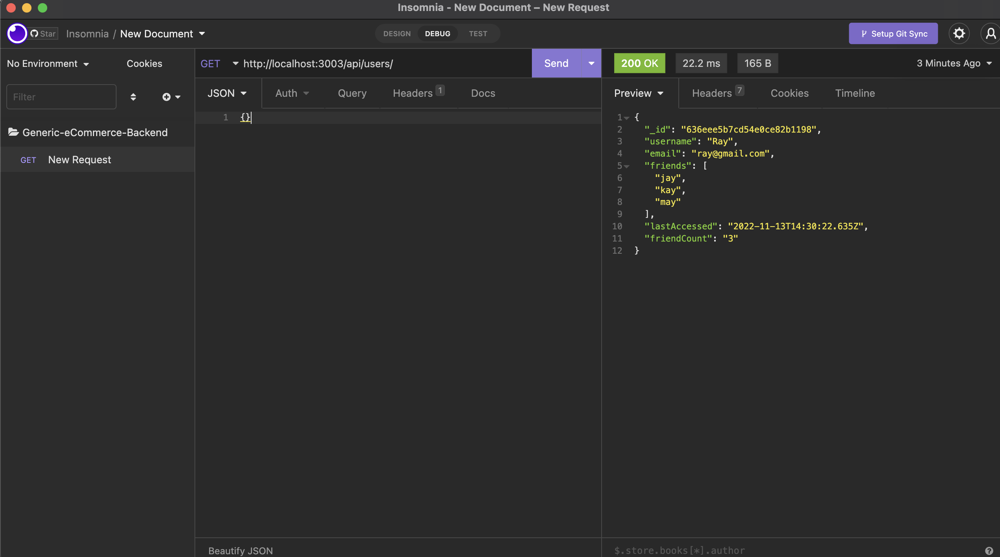

# SocialScape

## Description

Social network web application where users can share their thoughts, react to friends' thoughts, and create a friend list. Tech: Express.js, MongoDB and Mongoose ODM

## Table of Content

- [Installation](#installation)
- [Usage](#usage)
- [License](./LICENSE-APACHE.md)
- [Contributing](#contributing)
- [Test](#Test)
- [Questions](#questions)

## Installation

Clone the repository from github. Ensure to download and connect to MongoDB. Run npm install to download all the dependencies including, express, mongoose, and a date library of your choice. Then use Insomnia for all testing.

## Usage

## License

    This application is covered by the APACHE license.

## Contributing

To contribute, please email the creator for details.

## Test

No tests at this time.

## Questions

horatiousaharris@gmail.com
